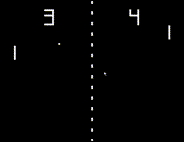

<a name="readme-top"></a>

<div align="center">
  
  <h3 align="center">DeepPong</h3>
  <p align="center">
    A Deep Learning Approach to Real-time Frame Generation for Pong.
    <br />
    <br />
  </p>
</div>


<details>
  <summary>Table of Contents</summary>
  <ol>
    <li>
      <a href="#about-the-project">About The Project</a>
    </li>
    <li>
      <a href="#getting-started">Getting Started</a>
      <ul>
        <li><a href="#prerequisites">Prerequisites</a></li>
        <li><a href="#installation">Installation</a></li>
      </ul>
    </li>
    <li><a href="#usage">Usage</a></li>
    <li><a href="#license">License</a></li>
    <li><a href="#acknowledgments">Acknowledgments</a></li>
  </ol>
</details>


## About The Project
DeepPong was my final submission for CSC 296S: Deep Learning at California State University, Sacramento. In this project, I explore the possibility of using neural networks to replace the traditional rasterization pipeline for rendering computer graphics in real time. For a more in-depth overview of the entire project, please see the accompanying [paper](/paper.pdf) written for this project (`paper.pdf`).

<p align="right">(<a href="#readme-top">back to top</a>)</p>


## Getting Started

To get this project up and running, follow these simple steps shown below.

### Prerequisites

To run this project, the easiest way is probably to use a standard installation of [Anaconda](https://www.anaconda.com/download) along with [Visual Studio Code](https://code.visualstudio.com/). You can find direct download links for past versions of Anaconda without signing up [here](https://repo.anaconda.com/archive/).

### Installation

Once Anaconda and Visual Studio Code are up and running...

1. Clone the repository.
   ```sh
   git clone https://github.com/PeanutButterRat/deeppong.git
   ```

2. Open `notebook.ipynb` in Visual Studio Code and select the standard Anaconda kernel in the top right.

3. Run the first notebook cell to install [pygame](https://www.pygame.org/news) or install pygame manually from the Anaconda terminal.
   ```sh
   pip install pygame
   ```

Now you should be ready to go!

<p align="right">(<a href="#readme-top">back to top</a>)</p>


## Usage

To use this notebook, you can run the cells to train different kinds of models based on a variety of parameters. If you are just interested in demoing the final application, just run the last cell.


## License

Distributed under the MIT License. See `LICENSE.txt` for more information.

<p align="right">(<a href="#readme-top">back to top</a>)</p>


## Acknowledgments

Here are some of the tools used to complete this project:

1. [BitFontMaker2](https://www.pentacom.jp/pentacom/bitfontmaker2/) for the Pong-styled font.
2. [jsfxr](https://chr15m.itch.io/jsfxr) for the arcade sound effects.
3. [Best-README-Template](https://github.com/othneildrew/Best-README-Template) for this README layout.

<p align="right">(<a href="#readme-top">back to top</a>)</p>
